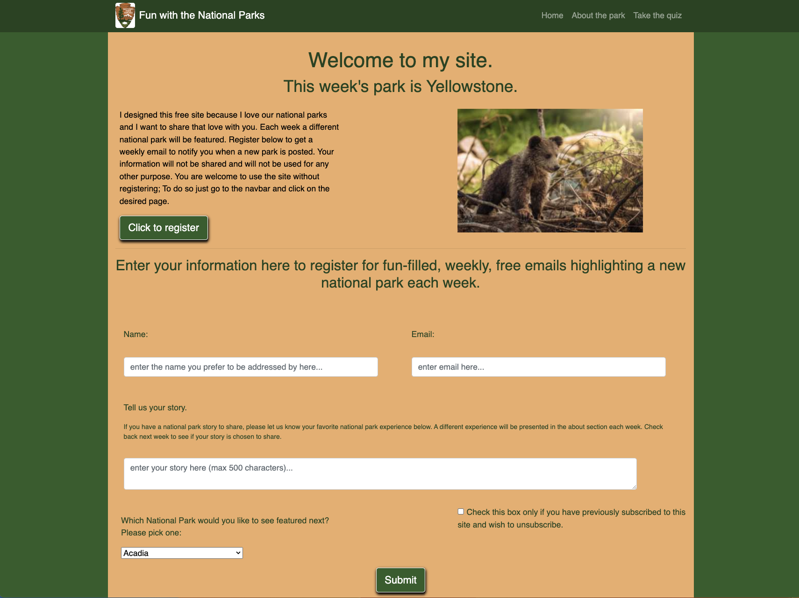

# national-park-blog-yellowstone

---

## Technology Used 

| Technology Used         | Resource URL           | 
| ------------- |:-------------:| 
| HTML    | [https://developer.mozilla.org/en-US/docs/Web/HTML](https://developer.mozilla.org/en-US/docs/Web/HTML) | 
| JavaScript    | [https://developer.mozilla.org/en-US/docs/Web/JavaScript](https://developer.mozilla.org/en-US/docs/Web/JavaScript) | 
| CSS     | [https://developer.mozilla.org/en-US/docs/Web/CSS](https://developer.mozilla.org/en-US/docs/Web/CSS)      |   
| Git | [https://git-scm.com/](https://git-scm.com/)     |    

---

## Description

[Visit the Deployed Site](https://jeffreydne.github.io/Jeff-Nelson-national-park-blog-yellowstone)

I designed this project from scratch

---

## Usage

This project was designed as a pilot to show case the basic design for a weekly blog on national parks, with a different park to be featured each week. The index.html page has a brief explanation of purpose as well as a way to sign up for the weekly blog. Additionally there is an about the park page which has information about the park divided into several categories, including history, wildlife, and geology in the park. Each section is accompnied by beautiful photos. And finally there is a timed quiz that the user can take, before or after reading about the park, to test theis knowledge. 

Below you will find a screenshot of the index page. 

```md

```
---

## Learning Points

During the making of this project I implemented HTML, CSS, and JavaScript. I strove to design a visually pleasing site that will represent me well. 

---

## Author Info

```md
### Jeffrey Nelson


* Portfolio(coming soon)
* [LinkedIn](https://www.linkedin.com/in/jeffrey-nelson13/)
* [Github](https://github.com/Jeffreydne)
```

---
## Credits

The table of technology used  in this README.md was provided by the excellent staff at UC Berkeley Extension Full Stack Bootcamp